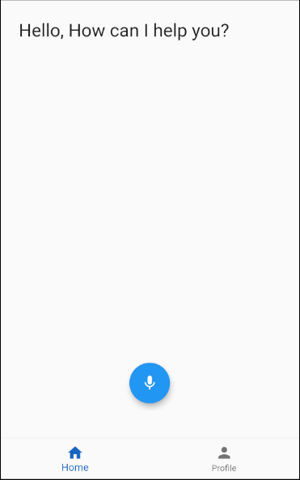
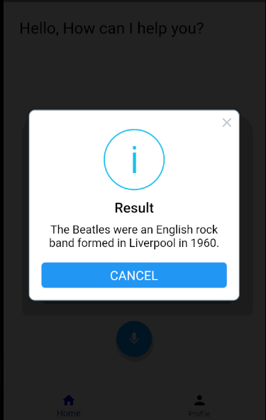
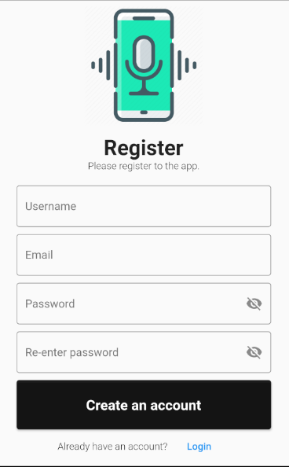
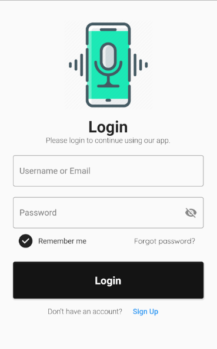

# Voice Assistant

A voice assistant which is capable at the moment:

* Answering questions.
* Exchange coins
* Translate sentences
* Calculate expressions

The project was written in Flask (Python) and Flutter (Dart) with the intention of learning various technologies used around the world.

### Setup

* Clone the repository
* Make sure you have Python and Flutter installed on your machine
* Install dependencies from pubspec.yaml and requirements.txt files.
* Run setup_sentence2vec_model.py in order to create the infersent_trained.pt model

Please make sure the server is running and the _serverUrl variable inside main.dart is set to your local machine ip.

### Screenshots

##### Main screen:

 

#### Login system:

 

